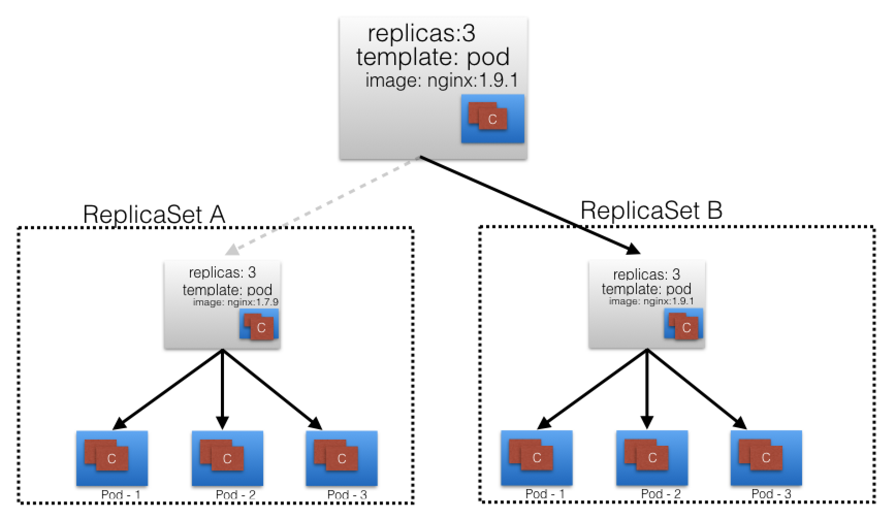

### Kubernetes Building Blocks

##### Kubernetes Object Model

Kubernetes has a very rich object model, representing different persistent entities in the Kubernetes cluster. Those entities describe:

- What containerized applications we are running and on which node
- Application resource consumption
- Different policies attached to applications, like restart/upgrade policies, fault tolerance, etc.
  With each object, we declare our intent spec section. The Kubernetes system manages the status section for objects, where it records the actual state of the object. At any given point in time, the Kubernetes Control Plane tries to match the object's actual state to the object's desired state.
  Examples of Kubernetes objects are Pods, ReplicaSets, Deployments, Namespaces, etc. We will explore them next.
  When creating an object, the object's configuration data section from below the spec field has to be submitted to the Kubernetes API server. The spec section describes the desired state, along with some basic information, such as the object's name.

[Checkout the example configarion file of deployment.](deployment.yml)

#### PODS

A Pod is the smallest and simplest Kubernetes object. It is the unit of deployment in Kubernetes, which represents a single instance of the application. A Pod is a logical collection of one or more containers, which:

- Are scheduled together on the same host with the Pod
- Share the same network namespace
- Have access to mount the same external storage (volumes).


[Checkout the example configarion file of pod.](pods.yml)

---

Controllers use **Label Selectors** to select a subset of objects. Kubernetes supports two types of Selectors:

**Equality-Based Selectors**
Equality-Based Selectors allow filtering of objects based on Label keys and values. Matching is achieved using the =, == (equals, used interchangeably), or != (not equals) operators. For example, with env==dev or env=dev we are selecting the objects where the env Label key is set to value dev.
**Set-Based Selectors**
Set-Based Selectors allow filtering of objects based on a set of values. We can use in, notin operators for Label values, and exist/does not exist operators for Label keys. For example, with env in (dev,qa) we are selecting objects where the env Label is set to either dev or qa; with !app we select objects with no Label key app.

##### ReplicaSets

A ReplicaSet is the next-generation ReplicationController. ReplicaSets support both equality- and set-based selectors, whereas ReplicationControllers only support equality-based Selectors.

Creating a pod to match current and desired state:


ReplicaSets can be used independently as Pod controllers but they only offer a limited set of features. A set of complementary features are provided by Deployments, the recommended controllers for the orchestration of Pods. Deployments manage the creation, deletion, and updates of Pods. A Deployment automatically creates a ReplicaSet, which then creates a Pod. There is no need to manage ReplicaSets and Pods separately, the Deployment will manage them on our behalf.

#### Deployments

Deployment objects provide declarative updates to Pods and ReplicaSets. The DeploymentController is part of the master node's controller manager, and it ensures that the current state always matches the desired state. It allows for seamless application updates and downgrades through rollouts and rollbacks, and it directly manages its ReplicaSets for application scaling.


> In the Deployment, we change the Pods' Template and we update the container image from nginx:1.7.9 to nginx:1.9.1. The Deployment triggers a new ReplicaSet B for the new container image versioned 1.9.1 and this association represents a new recorded state of the Deployment, Revision 2. The seamless transition between the two ReplicaSets, from ReplicaSet A with 3 Pods versioned 1.7.9 to the new ReplicaSet B with 3 new Pods versioned 1.9.1, or from Revision 1 to Revision 2, is a Deployment rolling update.



> The Deployment keeps its prior configuration states saved as Revisions which play a key factor in the rollback capability of the Deployment - returning to a prior known configuration state.

#### Namespaces

If multiple users and teams use the same Kubernetes cluster we can partition the cluster into virtual sub-clusters using Namespaces. The names of the resources/objects created inside a Namespace are unique, but not across Namespaces in the cluster.

> kubectl get namespaces

##### Demo commands for deployment ( nginx example ):

```
1. kubectl create deployment mynginx --image=nginx:1.15-alpine
2. kubectl get deploy,rs,po -l app=mynginx    // po : pod rs: replicas
3. kubectl  scale deploy mynginx --replicas=3
4. kubectl describe deployment
5. kubectl rollout history deploy mynginx  // see rollout history of deploy of my nginx
6. kubectl rollout history deploy mynginx --revision=1
7. kubectl set image deployment mynginx nginx=nginx:1.16-alpine   // update image
8. kubectl rollout undo deployment mynginx --to-revision=1
```
