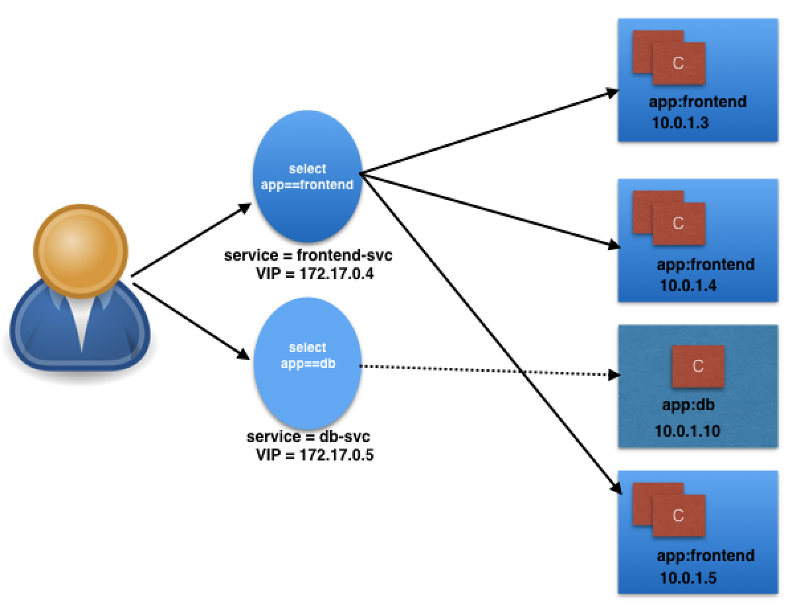

### Services

Services are used to group Pods to provide common access points from the external world to the containerized applications.

##### Connecting Users to PODS

To access the application, a user/client needs to connect to the Pods. As Pods are ephemeral in nature, resources like IP addresses allocated to it cannot be static. Pods could be terminated abruptly or be rescheduled based on existing requirements.

The user/client now connects to a Service via its ClusterIP, which forwards traffic to one of the Pods attached to it. A Service provides load balancing by default while selecting the Pods for traffic forwarding.

[Example](serviceObject.yml)

> If the targetPort is not defined explicitly, then traffic will be forwarded to Pods on the port on which the Service receives traffic.

##### kube-proxy

All worker nodes run a daemon called kube-proxy, which watches the API server on the master node for the addition and removal of Services and endpoints. In the example below, for each new Service, on each node, kube-proxy configures iptables rules to capture the traffic for its ClusterIP and forwards it to one of the Service's endpoints. Therefore any node can receive the external traffic and then route it internally in the cluster based on the iptables rules. When the Service is removed, kube-proxy removes the corresponding iptables rules on all nodes as well.

##### Service Discovery

1. Environment Variables
2. DNS

##### Service Type

Access scope is decided by ServiceType, which can be configured when creating the Service.

**ClusterIP and NodePort**

ClusterIP is the default ServiceType. A Service receives a Virtual IP address, known as its ClusterIP. This Virtual IP address is used for communicating with the Service and is accessible only within the cluster.

With the NodePort ServiceType, in addition to a ClusterIP, a high-port, dynamically picked from the default range 30000-32767, is mapped to the respective Service, from all the worker nodes.

The NodePort ServiceType is useful when we want to make our Services accessible from the external world. The end-user connects to any worker node on the specified high-port, which proxies the request internally to the ClusterIP of the Service, then the request is forwarded to the applications running inside the cluster.

**Load Balance**
With the LoadBalancer ServiceType:

- NodePort and ClusterIP are automatically created, and the external load balancer will route to them
- The Service is exposed externally using the underlying cloud provider's load balancer feature.
- The Service is exposed at a static port on each worker node

**ExternalIP**
A Service can be mapped to an ExternalIP address if it can route to one or more of the worker nodes. Traffic that is ingressed into the cluster with the ExternalIP (as destination IP) on the Service port, gets routed to one of the Service endpoints. This type of service requires an external cloud provider such as Google Cloud Platform or AWS.

**ExternalName**

ExternalName is a special ServiceType, that has no Selectors and does not define any endpoints. When accessed within the cluster, it returns a CNAME record of an externally configured Service.

The primary use case of this ServiceType is to make externally configured Services like my-database.example.com available to applications inside the cluster. If the externally defined Service resides within the same Namespace, using just the name my-database would make it available to other applications and Services within that same Namespace.
