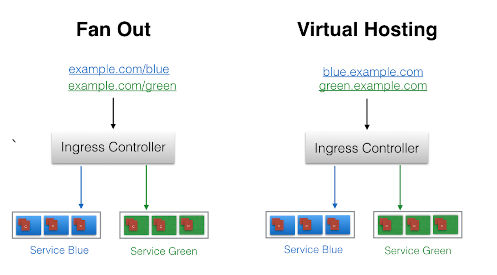

## Ingress

Another layer of abstraction, deployed in front of the Service API resources, offering a unified method of managing access to our applications from the external world.

We can access our deployed containerized application from the external world via Services. Among the ServiceTypes the NodePort and LoadBalancer are the most often used. For the LoadBalancer ServiceType, we need to have support from the underlying infrastructure. Even after having the support, we may not want to use it for every Service, as LoadBalancer resources are limited and they can increase costs significantly. Managing the NodePort ServiceType can also be tricky at times, as we need to keep updating our proxy settings and keep track of the assigned ports.

> With Services, routing rules are associated with a given Service. They exist for as long as the Service exists, and there are many rules because there are many Services in the cluster. If we can somehow decouple the routing rules from the application and centralize the rules management, we can then update our application without worrying about its external access. This can be done using the Ingress resource.

To allow the inbound connection to reach the cluster Services, Ingress configures a Layer 7 HTTP/HTTPS load balancer for Services and provides the following:

- TLS (Transport Layer Security)
- Name-based virtual hosting
- Fanout routing
- Loadbalancing
- Custom rules.

```apiVersion: networking.k8s.io/v1beta1
kind: Ingress
metadata:
  name: virtual-host-ingress
  namespace: default
spec:
  rules:
  - host: blue.example.com
    http:
      paths:
      - backend:
          serviceName: webserver-blue-svc
          servicePort: 80
  - host: green.example.com
    http:
      paths:
      - backend:
          serviceName: webserver-green-svc
          servicePort: 80
```

In the example above, user requests to both blue.example.com and green.example.com would go to the same Ingress endpoint, and, from there, they would be forwarded to webserver-blue-svc, and webserver-green-svc, respectively. This is an example of a Name-Based Virtual Hosting Ingress rule.

We can also have Fanout Ingress rules, when requests to example.com/blue and example.com/green would be forwarded to webserver-blue-svc and webserver-green-svc, respectively:

```
apiVersion: networking.k8s.io/v1beta1
kind: Ingress
metadata:
  name: fan-out-ingress
  namespace: default
spec:
  rules:
  - host: example.com
    http:
      paths:
      - path: /blue
        backend:
          serviceName: webserver-blue-svc
          servicePort: 80
      - path: /green
        backend:
          serviceName: webserver-green-svc
          servicePort: 80
```



#### Ingress Controller

An Ingress Controller is an application watching the Master Node's API server for changes in the Ingress resources and updates the Layer 7 Load Balancer accordingly. Kubernetes supports different Ingress Controllers, and, if needed, we can also build our own. GCE L7 Load Balancer Controller and Nginx Ingress Controller are commonly used Ingress Controllers. Other controllers are Istio, Kong, Traefik, etc.

> minikube addons enable ingress
> minikube ip  
> kubectl create -f virtual-host-ingress.yaml
