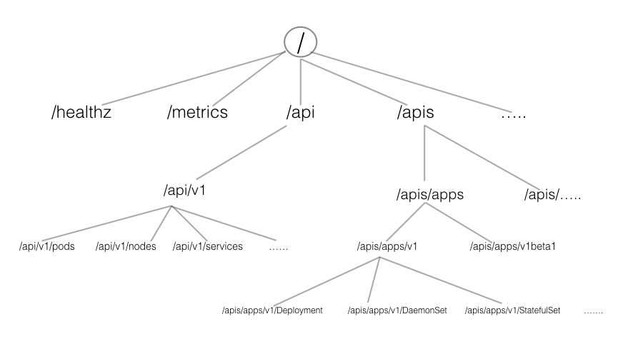

#### Minikube

##### Installation

```
 - curl -Lo minikube https://storage.googleapis.com/minikube/releases/v1.0.1/minikube-linux-amd64 && - - chmod +x minikube && sudo mv minikube /usr/local/bin/
```

```
- minikube start
- service docker start
- minikube status
- minicube stop
```

> CRI-O is an implementation of the Kubernetes CRI (Container Runtime Interface) to enable using OCI (Open Container Initiative) compatible runtimes.

```
- minikube start --container-runtime=cri-o
- minicube ssh    // login to minicube vm
- sudo docker container ls
- sudo runc list // list the container created by cri-o runtime
```

##### Accessing minicube

- Command Line Interface (CLI) tools and scripts ( kubectl )
- Web-based User Interface (Web UI) from a web browser ([Web ui Dashboard](https://kubernetes.io/docs/tasks/access-application-cluster/web-ui-dashboard/))
- APIs from CLI or programmatically



**Core Group (/api/v1)**

This group includes objects such as Pods, Services, nodes, namespaces, configmaps, secrets, etc.

**Named Group**

This group includes objects in /apis/$NAME/$VERSION format. These different API versions imply different levels of stability and support:

- Alpha level - it may be dropped at any point in time, without notice. For example, /apis/batch/v2alpha1.
- Beta level - it is well-tested, but the semantics of objects may change in incompatible ways in a subsequent beta or stable release. For example, /apis/certificates.k8s.io/v1beta1.
- Stable level - appears in released software for many subsequent versions. For example, /apis/networking.k8s.io/v1.

**System-wide**
This group consists of system-wide API endpoints, like /healthz, /logs, /metrics, /ui, etc.

---

##### kubectl

###### Installation

```
- curl -LO https://storage.googleapis.com/kubernetes-release/release/$(curl -s https://storage.googleapis.com/kubernetes-release/release/stable.txt)/bin/linux/amd64/kubectl && chmod +x kubectl && sudo mv kubectl /usr/local/bin/
- curl -LO https://storage.googleapis.com/kubernetes-release/release/v1.14.1/bin/linux/amd64/kubectl && chmod +x kubectl && sudo mv kubectl /usr/local/bin/
```

```
- kubectl config view  or  ~/.kube/config (linux)
- kubectl cluster-info
- minikube dashboard  // web interface
- kubectl proxy // Issuing the kubectl proxy command, kubectl authenticates with the API server on the master node and makes the Dashboard available on a slightly different URL than the one earlier, this time through the proxy port 8001.
- curl http://localhost:8001/
```

##### APIs - without 'kubectl proxy'

When not using the kubectl proxy, we need to authenticate to the API server when sending API requests. We can authenticate by providing a Bearer Token when issuing a curl, or by providing a set of keys and certificates.

_Get the token :_

> TOKEN=$(kubectl describe secret -n kube-system $(kubectl get secrets -n kube-system | grep default | cut -f1 -d ' ') | grep -E '^token' | cut -f2 -d':' | tr -d '\t' | tr -d " ")

_Get the API server endpoint_

> APISERVER=\$(kubectl config view | grep https | cut -f 2- -d ":" | tr -d " ")

_Confirm that the APISERVER stored the same IP as the Kubernetes master IP by issuing the following 2 commands and comparing their outputs:_

> echo \$APISERVER
> kubectl cluster-info

_Access the API server using the curl command_

> curl $APISERVER --header "Authorization: Bearer $TOKEN" --insecure
