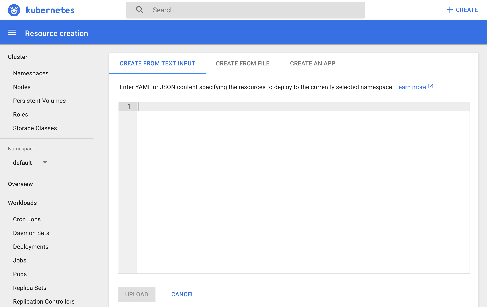
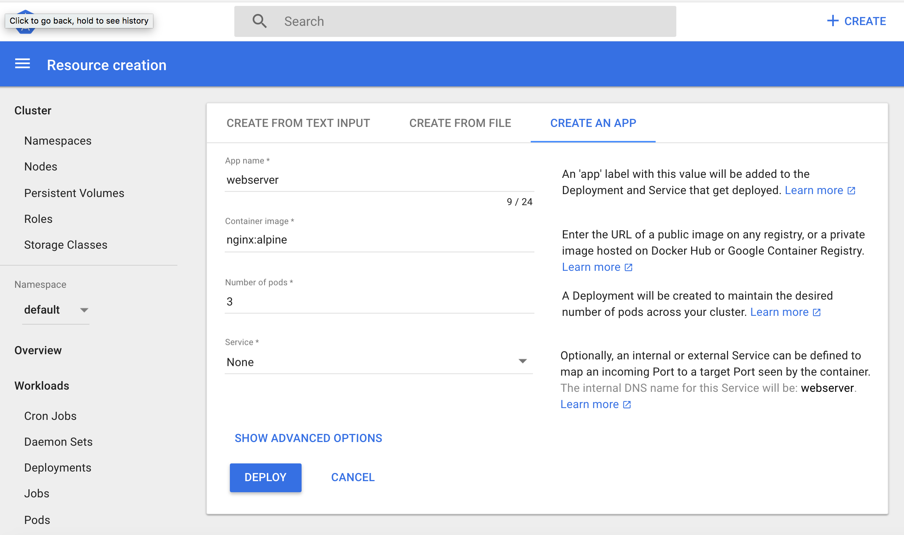
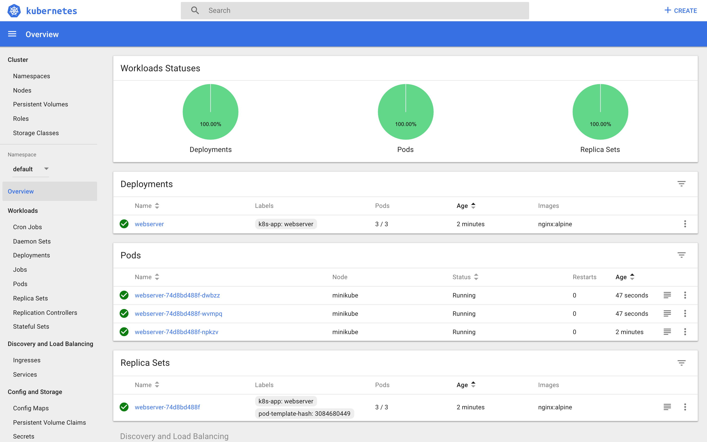

### Deployment

_Using Dashboard_:

```
1. minikube start
2. minikube status
3. minikube dashboard
```





```
- kubectl get deployments
- kubectl get replicasets
- kubectl get pods
- kubectl describe pod webserver-<from dashboard>
- kubectl get pods -L k8s-app,label2 // List the Pods, along with their attached Labels
```

**Deployment Using CLI**

```
- kubectl delete deployments webserver
- create the [webserver.yaml](webserver.yaml) file,
- kubectl create -f webserver.yaml
- kubectl get replicasets
- kubectl get pods
```

**Exposing Application**

```
- Create a [webserver-svc.yaml](webserver-svc.yaml) file
- kubectl create -f webserver-svc.yaml
- kubectl expose deployment webserver --name=web-service --type=NodePort
- kubectl get services
// Our web-service is now created and its ClusterIP is 10.110.47.84. In the PORT(S)section, we see a mapping of 80:31074, which means that we have reserved a static port 31074 on the node. If we connect to the node on that port, our requests will be proxied to the ClusterIP on port 80.

- kubectl describe service web-service
- minikube up
- minikube service web-service // open the application in the browser
```

##### Liveness and Readiness Probes

While containerized applications are scheduled to run in pods on nodes across our cluster, at times the applications may become unresponsive or may be delayed during startup. Implementing Liveness and Readiness Probes allows the kubelet to control the health of the application running inside a Pod's container and force a container restart of an unresponsive application. When defining both Readiness and Liveness Probes, it is recommended to allow enough time for the Readiness Probe to possibly fail a few times before a pass, and only then check the Liveness Probe. If Readiness and Liveness Probes overlap there may be a risk that the container never reaches ready state.

**Liveness**

If a container in the Pod is running, but the application running inside this container is not responding to our requests, then that container is of no use to us. This kind of situation can occur, for example, due to application deadlock or memory pressure. In such a case, it is recommended to restart the container to make the application available.

Rather than restarting it manually, we can use a Liveness Probe. Liveness probe checks on an application's health, and if the health check fails, kubelet restarts the affected container automatically.

Liveness Probes can be set by defining:

- Liveness command
- Liveness HTTP request
- TCP Liveness Probe.

###### Liverness command

In the following example, we are checking the existence of a file /tmp/healthy:

[Demo exec-liveness.yml](exec-liveness.yml)

The existence of the /tmp/healthy file is configured to be checked every 5 seconds using the periodSeconds parameter. The initialDelaySeconds parameter requests the kubelet to wait for 5 seconds before the first probe. When running the command line argument to the container, we will first create the /tmp/healthy file, and then we will remove it after 30 seconds. The deletion of the file would trigger a health failure, and our Pod would get restarted.

In the following example, the kubelet sends the HTTP GET request to the /healthz endpoint of the application, on port 8080. If that returns a failure, then the kubelet will restart the affected container; otherwise, it would consider the application to be alive.

**Liveness HTTP Request**

In the following example, the kubelet sends the HTTP GET request to the /healthz endpoint of the application, on port 8080. If that returns a failure, then the kubelet will restart the affected container; otherwise, it would consider the application to be alive.

```
livenessProbe:
      httpGet:
        path: /healthz
        port: 8080
        httpHeaders:
        - name: X-Custom-Header
          value: Awesome
      initialDelaySeconds: 3
      periodSeconds: 3
```

**TCP Liveness Probe**

With TCP Liveness Probe, the kubelet attempts to open the TCP Socket to the container which is running the application. If it succeeds, the application is considered healthy, otherwise the kubelet would mark it as unhealthy and restart the affected container.

```
livenessProbe:
      tcpSocket:
        port: 8080
      initialDelaySeconds: 15
      periodSeconds: 20
```

**Readiness Probes**

Sometimes, applications have to meet certain conditions before they can serve traffic. These conditions include ensuring that the depending service is ready, or acknowledging that a large dataset needs to be loaded, etc. In such cases, we use Readiness Probes and wait for a certain condition to occur. Only then, the application can serve traffic.

A Pod with containers that do not report ready status will not receive traffic from Kubernetes Services.

```
readinessProbe:
  exec:
    command:
    - cat
    - /tmp/healthy
  initialDelaySeconds: 5
  periodSeconds: 5
```
