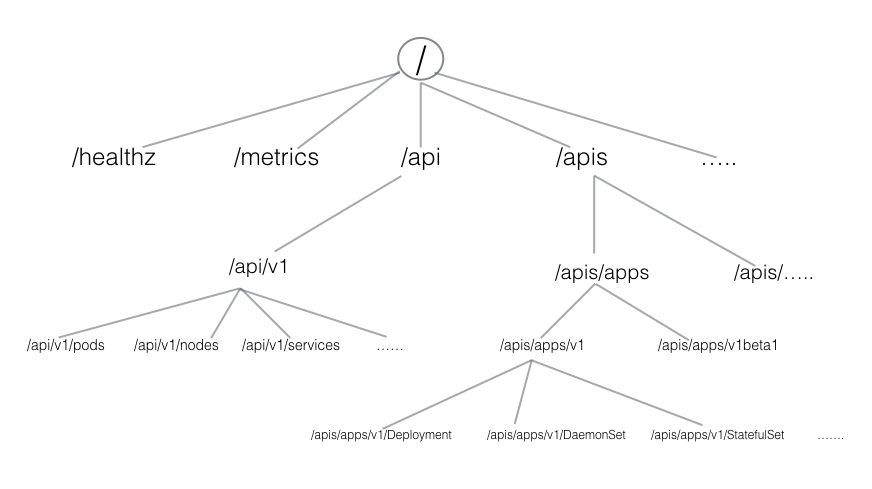

# Kubernetes-GCP

#### Orchestration

In Development (Dev) environments, running containers on a single host for development and testing of applications may be an option. However, when migrating to Quality Assurance (QA) and Production (Prod) environments, that is no longer a viable option because the applications and services need to meet specific requirements:

- Fault-tolerance
- On-demand scalability
- Optimal resource usage
- Auto-discovery to automatically discover and communicate with each other
- Accessibility from the outside world
- Seamless updates/rollbacks without any downtime.

**Container orchestrators** are tools which group systems together to form clusters where containers' deployment and management is automated at scale while meeting the requirements mentioned above.

**Most container orchestrators can**
Group hosts together while creating a cluster
Schedule containers to run on hosts in the cluster based on resources availability
Enable containers in a cluster to communicate with each other regardless of the host they are deployed to in the cluster
Bind containers and storage resources
Group sets of similar containers and bind them to load-balancing constructs to simplify access to containerized applications by creating a level of abstraction between the containers and the user
Manage and optimize resource usage
Allow for implementation of policies to secure access to applications running inside containers.

#### Kubernetes offers a very rich set of features for container orchestration. Some of its fully supported features are:

- Automatic bin packing
- Kubernetes automatically schedules containers based on resource needs and constraints, to maximize utilization without sacrificing availability.
- Self-healing
- Kubernetes automatically replaces and reschedules containers from failed nodes. It kills and restarts containers unresponsive to health checks, based on existing rules/policy. It also prevents traffic from being routed to unresponsive containers.
- Horizontal scaling
- With Kubernetes applications are scaled manually or automatically based on CPU or custom metrics utilization.
- Service discovery and Load balancing
- Containers receive their own IP addresses from Kubernetes, while it assigns a single Domain Name System (DNS) name to a set of containers to aid in load-balancing requests across the containers of the set.
- Automated rollouts and rollbacks
- Kubernetes seamlessly rolls out and rolls back application updates and configuration changes, constantly monitoring the application's health to prevent any downtime.
- Secret and configuration management
- Kubernetes manages secrets and configuration details for an application separately from the container image, in order to avoid a re-build of the respective image. Secrets consist of confidential information passed to the application without revealing the sensitive content to the stack configuration, like on GitHub.
- Storage orchestration
- Kubernetes automatically mounts software-defined storage (SDS) solutions to containers from local storage, external cloud providers, or network storage systems.
- Batch execution
- Kubernetes supports batch execution, long-running jobs, and replaces failed containers.

###### The Cloud Native Computing Foundation (CNCF)

CNCF is one of the projects hosted by the Linux Foundation. CNCF aims to accelerate the adoption of containers, microservices, and cloud-native applications.

CNCF hosts a multitude of projects, with more to be added in the future. CNCF provides resources to each of the projects, but, at the same time, each project continues to operate independently under its pre-existing governance structure and with its existing maintainers. Projects within CNCF are categorized based on achieved status: Sandbox, Incubating, and Graduated. At the time this course was created, there were six projects with Graduated status (Kubernetes) and many more still Incubating and in the Sandbox.

### Kubernetes Architecture

At a very high level, Kubernetes has the following main components:

- One or more master nodes
- One or more worker nodes
- Distributed key-value store, such as etcd.

#### Master Node

The master node provides a running environment for the control plane responsible for managing the state of a Kubernetes cluster, and it is the brain behind all operations inside the cluster. The control plane components are agents with very distinct roles in the cluster's management. In order to communicate with the Kubernetes cluster, users send requests to the master node via a Command Line Interface (CLI) tool, a Web User-Interface (Web UI) Dashboard, or Application Programming Interface (API).

A master node has the following components:

- API server
- Scheduler
- Controller managers
- etcd

**Master: API server**
All the administrative tasks are coordinated by the kube-apiserver, a central control plane component running on the master node. The API server intercepts RESTful calls from users, operators and external agents, then validates and processes them. During processing the API server reads the Kubernetes cluster's current state from the etcd, and after a call's execution, the resulting state of the Kubernetes cluster is saved in the distributed key-value data store for persistence. The API server is the only master plane component to talk to the etcd data store, both to read and to save Kubernetes cluster state information from/to it - acting as a middle-man interface for any other control plane agent requiring to access the cluster's data store.

**Master:Scheduler**
The role of the kube-scheduler is to assign new objects, such as pods, to nodes. During the scheduling process, decisions are made based on current Kubernetes cluster state and new object's requirements. The scheduler obtains from etcd, via the API server, resource usage data for each worker node in the cluster. The scheduler also receives from the API server the new object's requirements which are part of its configuration data. Requirements may include constraints that users and operators set, such as scheduling work on a node labeled with disk==ssd key/value pair. The scheduler also takes into account Quality of Service (QoS) requirements, data locality, affinity, anti-affinity, taints, toleration, etc.

**Master:Controller Managers**
The controller managers are control plane components on the master node running controllers to regulate the state of the Kubernetes cluster. Controllers are watch-loops continuously running and comparing the cluster's desired state (provided by objects' configuration data) with its current state (obtained from etcd data store via the API server). In case of a mismatch corrective action is taken in the cluster until its current state matches the desired state.
The kube-controller-manager runs controllers responsible to act when nodes become unavailable, to ensure pod counts are as expected, to create endpoints, service accounts, and API access tokens.
The cloud-controller-manager runs controllers responsible to interact with the underlying infrastructure of a cloud provider when nodes become unavailable, to manage storage volumes when provided by a cloud service, and to manage load balancing and routing.

**Master:etcd**
etcd is a distributed key-value data store used to persist a Kubernetes cluster's state. New data is written to the data store only by appending to it, data is never replaced in the data store. Obsolete data is compacted periodically to minimize the size of the data store.
Out of all the control plane components, only the API server is able to communicate with the etcd data store.
etcd's CLI management tool provides backup, snapshot, and restore capabilities which come in handy especially for a single etcd instance Kubernetes cluster - common in Development and learning environments. However, in Stage and Production environments, it is extremely important to replicate the data stores in HA mode, for cluster configuration data resiliency.
Besides storing the cluster state, etcd is also used to store configuration details such as subnets, ConfigMaps, Secrets, etc.

#### Worker Node

A worker node provides a running environment for client applications. Though containerized microservices, these applications are encapsulated in Pods, controlled by the cluster control plane agents running on the master node. Pods are scheduled on worker nodes, where they find required compute, memory and storage resources to run, and networking to talk to each other and the outside world.
_A Pod is the smallest scheduling unit in Kubernetes. It is a logical collection of one or more containers scheduled together._


A worker node has the following components:

- Container runtime
- kubelet
- kube-proxy
- Addons for DNS, Dashboard, cluster-level monitoring and logging.

**Kubernetes does not have the capability to directly handle containers. In order to run and manage a container's lifecycle, Kubernetes requires a container runtime on the node where a Pod and its containers are to be scheduled.**

**WorkerNode:kubelet**
The kubelet is an agent running on each node and communicates with the control plane components from the master node. It receives Pod definitions, primarily from the API server, and interacts with the container runtime on the node to run containers associated with the Pod. It also monitors the health of the Pod's running containers.
The kubelet connects to the container runtime using Container Runtime Interface (CRI). CRI consists of protocol buffers, gRPC API, and libraries.


CRI implements two services: `ImageService` and `RuntimeService`. The ImageService is responsible for all the image-related operations, while the RuntimeService is responsible for all the Pod and container-related operations.


**WorkerNode:kube-proxy**
The kube-proxy is the network agent which runs on each node responsible for dynamic updates and maintenance of all networking rules on the node. It abstracts the details of Pods networking and forwards connection requests to Pods.

**Worker Node Components: Addons**
Addons are cluster features and functionality not yet available in Kubernetes, therefore implemented through 3rd-party pods and services.

- DNS - cluster DNS is a DNS server required to assign DNS records to Kubernetes objects and resources
- Dashboard - a general purposed web-based user interface for cluster management
- Monitoring - collects cluster-level container metrics and saves them to a central data store
- Logging - collects cluster-level container logs and saves them to a central log store for analysis.

_The Kubernetes network model aims to reduce complexity, and it treats Pods as VMs on a network, where each VM receives an IP address - thus each Pod receiving an IP address. This model is called "IP-per-Pod" and ensures Pod-to-Pod communication, just as VMs are able to communicate with each other._

**_Container Network Interface (CNI)_**


**For a successfully deployed containerized applications running in Pods inside a Kubernetes cluster, it requires accessibility from the outside world. Kubernetes enables external accessibility through services, complex constructs which encapsulate networking rules definitions on cluster nodes. By exposing services to the external world with kube-proxy, applications become accessible from outside the cluster over a virtual IP.**

## Installation

Kubernetes can be installed using different configurations. The four major installation types are briefly presented below:

- **All-in-One Single-Node Installation**
  In this setup, all the master and worker components are installed and running on a single-node. While it is useful for learning, development, and testing, it should not be used in production. Minikube is one such example, and we are going to explore it in future chapters.
- **Single-Node etcd, Single-Master and Multi-Worker Installation**
  In this setup, we have a single-master node, which also runs a single-node etcd instance. Multiple worker nodes are connected to the master node.
- **Single-Node etcd, Multi-Master and Multi-Worker Installation**
  In this setup, we have multiple-master nodes configured in HA mode, but we have a single-node etcd instance. Multiple worker nodes are connected to the master nodes.
- **Multi-Node etcd, Multi-Master and Multi-Worker Installation**
  In this mode, etcd is configured in clustered HA mode, the master nodes are all configured in HA mode, connecting to multiple worker nodes. This is the most advanced and recommended production setup.

#### LocalHost Installation

These are only a few localhost installation options available to deploy single- or multi-node Kubernetes clusters on our workstation/laptop:

- Minikube - single-node local Kubernetes cluster
- Docker Desktop - single-node local Kubernetes cluster for Windows and Mac
- CDK on LXD - multi-node local cluster with LXD containers.
- Minikube is the preferred and recommended way to create an all-in-one Kubernetes setup locally.

#### Some useful tools/resources available:

**kubeadm**

[kubeadm](https://github.com/kubernetes/kubeadm) is a first-class citizen on the Kubernetes ecosystem. It is a secure and recommended way to bootstrap a single- or multi-node Kubernetes cluster. It has a set of building blocks to setup the cluster, but it is easily extendable to add more features. Please note that kubeadm does not support the provisioning of hosts.

**kubespray**
With [kubespray](https://kubernetes.io/docs/setup/production-environment/tools/kubespray/) (formerly known as kargo), we can install Highly Available Kubernetes clusters on AWS, GCE, Azure, OpenStack, or bare metal. Kubespray is based on Ansible, and is available on most Linux distributions. It is a Kubernetes Incubator project.

**kops**

With [kops](https://kubernetes.io/docs/setup/custom-cloud/kops/), we can create, destroy, upgrade, and maintain production-grade, highly-available Kubernetes clusters from the command line. It can provision the machines as well. Currently, AWS is officially supported. Support for GCE is in beta, and VMware vSphere in alpha stage, and other platforms are planned for the future. Explore the kops project for more details.

**kube-aws**

With [kube-aws](https://github.com/kubernetes-incubator/kube-aws) we can create, upgrade and destroy Kubernetes clusters on AWS from the command line. Kube-aws is also a Kubernetes Incubator project.

---

- **kubectl** is a binary used to access and manage any Kubernetes cluster

#### Minikube

##### Installation

```
 - curl -Lo minikube https://storage.googleapis.com/minikube/releases/v1.0.1/minikube-linux-amd64 && - - chmod +x minikube && sudo mv minikube /usr/local/bin/
```

```
- minikube start
- service docker start
- minikube status
- minicube stop
```

> CRI-O is an implementation of the Kubernetes CRI (Container Runtime Interface) to enable using OCI (Open Container Initiative) compatible runtimes.

```
- minikube start --container-runtime=cri-o
- minicube ssh    // login to minicube vm
- sudo docker container ls
- sudo runc list // list the container created by cri-o runtime
```

##### Accessing minicube

- Command Line Interface (CLI) tools and scripts ( kubectl )
- Web-based User Interface (Web UI) from a web browser ([Web ui Dashboard](https://kubernetes.io/docs/tasks/access-application-cluster/web-ui-dashboard/))
- APIs from CLI or programmatically


**Core Group (/api/v1)**

This group includes objects such as Pods, Services, nodes, namespaces, configmaps, secrets, etc.

**Named Group**

This group includes objects in /apis/$NAME/$VERSION format. These different API versions imply different levels of stability and support:

- Alpha level - it may be dropped at any point in time, without notice. For example, /apis/batch/v2alpha1.
- Beta level - it is well-tested, but the semantics of objects may change in incompatible ways in a subsequent beta or stable release. For example, /apis/certificates.k8s.io/v1beta1.
- Stable level - appears in released software for many subsequent versions. For example, /apis/networking.k8s.io/v1.

**System-wide**
This group consists of system-wide API endpoints, like /healthz, /logs, /metrics, /ui, etc.

---

##### kubectl

###### Installation

```
- curl -LO https://storage.googleapis.com/kubernetes-release/release/$(curl -s https://storage.googleapis.com/kubernetes-release/release/stable.txt)/bin/linux/amd64/kubectl && chmod +x kubectl && sudo mv kubectl /usr/local/bin/
- curl -LO https://storage.googleapis.com/kubernetes-release/release/v1.14.1/bin/linux/amd64/kubectl && chmod +x kubectl && sudo mv kubectl /usr/local/bin/
```

```
- kubectl config view  or  ~/.kube/config (linux)
- kubectl cluster-info
- minikube dashboard  // web interface
- kubectl proxy // Issuing the kubectl proxy command, kubectl authenticates with the API server on the master node and makes the Dashboard available on a slightly different URL than the one earlier, this time through the proxy port 8001.
- curl http://localhost:8001/
```

##### APIs - without 'kubectl proxy'

When not using the kubectl proxy, we need to authenticate to the API server when sending API requests. We can authenticate by providing a Bearer Token when issuing a curl, or by providing a set of keys and certificates.

_Get the token :_

> TOKEN=$(kubectl describe secret -n kube-system $(kubectl get secrets -n kube-system | grep default | cut -f1 -d ' ') | grep -E '^token' | cut -f2 -d':' | tr -d '\t' | tr -d " ")

_Get the API server endpoint_

> APISERVER=\$(kubectl config view | grep https | cut -f 2- -d ":" | tr -d " ")

_Confirm that the APISERVER stored the same IP as the Kubernetes master IP by issuing the following 2 commands and comparing their outputs:_

> echo \$APISERVER
> kubectl cluster-info

_Access the API server using the curl command_

> curl $APISERVER --header "Authorization: Bearer $TOKEN" --insecure
